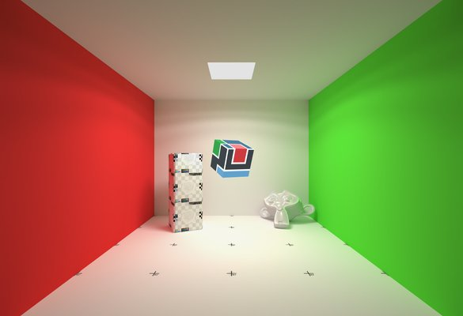

# WebGL Cornell box for BabylonJS

This is just a simple kind-of cornell box, deserve as making quick tests inside 3D realtime engine BabylonJS.

- You can view a live demo on [my website](https://www.nothing-is-3d.com/data/medias/folio/3drealtime/cornellBox/), showing some different kind of exported files
- [BJS forum post here](https://forum.babylonjs.com/t/a-cornell-box-scene-to-serve-as-testing-scene/1200)

Of course, feel free to do whatever you want with these assets.

